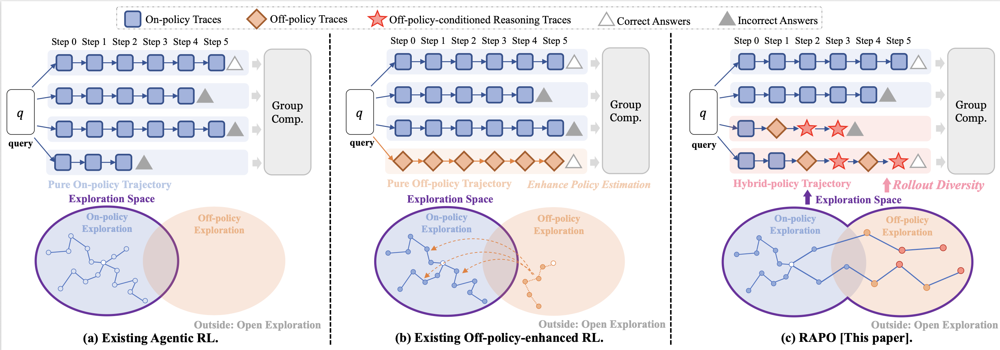
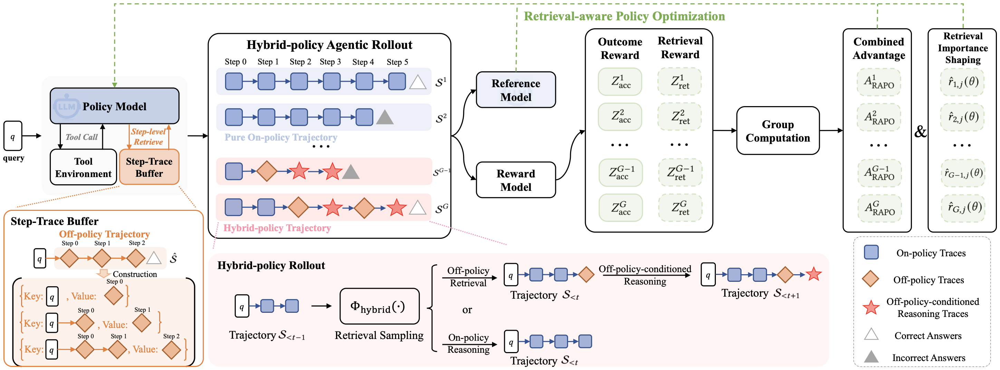

# 🏆 KDD 2026 RAPO

This is the official implementation for KDD 2026 Research Track Paper: **RAPO: Expanding Exploration for LLM Agents via Retrieval-Augmented Policy Optimization**.

We provide the related resources here: [[📃 Paper](https://arxiv.org/abs/2603.03078)]

</img>

RAPO is a retrieval-augmented Agentic RL framework that expands policy exploration for LLM agents by retrieving step-level off-policy traces during rollout and by calibrating policy optimization with retrieval-aware rewards and importance shaping.

We propose RAPO for tool-integrated, multi-step reasoning:

* 🔎 We design **Hybrid-policy Agentic Rollout**, which lets the on-policy agent reason over retrieved off-policy step traces and dynamically broadens the agent's reasoning receptive field.
* ⚙️ We introduce **Retrieval-aware Policy Optimization**, which stabilizes policy-gradient estimation with retrieval reward and importance shaping, prioritizing exploration that is useful for downstream policy improvement.
* 🧪 We build a practical training pipeline for computational reasoning, knowledge-intensive reasoning, and tool-augmented agentic reasoning tasks.

</img>

> 📝 Feel free to cite this work if you find it useful.

```bibtex
@inproceedings{zhang2026rapo,
	title={RAPO: Expanding Exploration for LLM Agents via Retrieval-Augmented Policy Optimization},
	author={Siwei Zhang and Yun Xiong and Xi Chen and Zi'an Jia and Renhong Huang and Jiarong Xu and Jiawei Zhang},
	booktitle={Proceedings of the ACM SIGKDD Conference on Knowledge Discovery and Data Mining},
	year={2026}
}
```

### 🔥 News

- *Jul 2026* 🎉 RAPO was accepted by **KDD 2026**.
- *Mar 2026* 📚 We posted the first version of the paper on arXiv.

## 🚀 How to Run RAPO

The training pipeline has three stages: build the Wikipedia search service, construct the Step-Trace Buffer, and train RAPO with the retrieval service enabled.

### 🛠️ Step 1: Prepare Environments

We recommend separating the RL environment from the search and retrieval service environment to avoid dependency conflicts.

**RL environment**

```bash
conda create -n rapo python=3.12.9
conda activate rapo

pip install torch==2.6.0 torchvision==0.21.0 torchaudio==2.6.0
pip install vllm==0.8.5.post1
pip install flash-attn --no-build-isolation
pip install swanlab wandb

# Install the RAPO training fork of verl.
pip install -e RAPO/verl_rapo_entropy

# Install the buffer-construction fork when building the Step-Trace Buffer.
pip install -e Buffer/verl_arpo_entropy
```

**Search and retrieval environment**

```bash
conda create -n retriever python=3.10.13
conda activate retriever

pip install torch==2.6.0 torchvision==0.21.0 torchaudio==2.6.0
pip install transformers datasets pyserini tqdm uvicorn fastapi
pip install faiss-gpu==1.7.3
```

### 📦 Step 2: Prepare Data and Tool Configuration

The RL training data used by the provided scripts is included under:

```text
RAPO/rl_datasets/
Buffer/rl_datasets/
```

Download the Wikipedia corpus from [wiki-18-corpus](https://huggingface.co/datasets/PeterJinGo/wiki-18-corpus), place it under `wiki/`, and decompress it:

```bash
mkdir -p wiki
gzip -dk wiki/wiki-18.jsonl.gz
```

Configure the Python tool executor in both trainer configs:

```yaml
actor_rollout_ref:
	rollout:
		tools:
			tool_instances:
				python:
					params:
						conda_path: YOUR_CONDA_PATH
						conda_env: YOUR_PYTHON_ENV_NAME
```

Files to update:

```text
Buffer/scripts/config/ppo_trainer.yaml
RAPO/scripts/config/ppo_trainer.yaml
```

### 🔍 Step 3: Launch the Wikipedia Search Service

Build the FAISS index for the Wikipedia corpus and start the search API at `http://127.0.0.1:8001/wikiSearch`:

```bash
conda activate retriever

python build_search_index.py \
	--corpus_path wiki/wiki-18.jsonl \
	--index_path wiki/wiki18_MiniLM.index

python search_server.py \
	--corpus_path wiki/wiki-18.jsonl \
	--index_path wiki/wiki18_MiniLM.index \
	--topk 3
```

### 🧱 Step 4: Construct the Step-Trace Buffer

Use the buffer-construction pipeline to generate retrieval candidates from AEPO-Qwen3-14B rollouts:

```bash
conda activate rapo
bash Buffer/scripts/Reasoning_corpus.sh
```

The retrieval index builder expects the final Step-Trace Buffer at:

```text
rollout/Step_Trace_Buffer.jsonl
```

If your generated rollouts are saved under `Buffer/rl_output/<exp_name>/rollout/`, merge or export them into the JSONL file above before building the retrieval index.

### 🧭 Step 5: Launch the Step-Trace Retrieval Service

Build the FAISS index for the Step-Trace Buffer and start the retrieval API at `http://127.0.0.1:8005/retrieve`:

```bash
conda activate retriever

python build_retrieve_index.py \
	--corpus_path rollout/Step_Trace_Buffer.jsonl \
	--index_path rollout/Step_Trace_Buffer.index

python retrieve_server.py \
	--corpus_path rollout/Step_Trace_Buffer.jsonl \
	--index_path rollout/Step_Trace_Buffer.index \
	--topk 3
```

### 🏃 Step 6: Train RAPO

Train RAPO on the reasoning-task training split with Qwen2.5-7B-Instruct:

```bash
conda activate rapo
bash RAPO/scripts/RAPO_7B_Reasoning.sh
```

Important training knobs are exposed in `RAPO/scripts/RAPO_7B_Reasoning.sh`:

```bash
ROLLOUT_N=16
INITIAL_ROLLOUTS=16
BEAM_SIZE=2
BRANCH_PROBABILITY=0.5
no_retrieve_first_k=8
retrieve_prob=0.5
shaping_weight=0.05
advantage_weight=0.2
```

## 📊 Evaluation

Evaluation scripts and datasets are provided under `evaluation/`. A typical workflow is:

1. Launch the reasoning model with vLLM. Example launch scripts are under `evaluation/vllm_scripts/`.
2. Edit `evaluation/infer_local_sds.sh` with your model path, output path, Conda path, Bing Search key, summarization model endpoints, and dataset list.
3. Run inference:

```bash
cd evaluation
bash infer_local_sds.sh
```

4. Run metric evaluation on the generated output:

```bash
cd evaluation
OUTPUT_PATH=<path_to_output_json_or_jsonl> TASK=<math_or_qa> bash evaluate.sh
```

## 📁 Repository Structure

```text
RAPO_public/
├── RAPO/                         # RAPO training pipeline and verl fork
│   ├── scripts/RAPO_7B_Reasoning.sh
│   ├── scripts/config/ppo_trainer.yaml
│   └── rl_datasets/
├── Buffer/                       # Step-Trace Buffer construction pipeline
│   ├── scripts/Reasoning_corpus.sh
│   ├── scripts/config/ppo_trainer.yaml
│   └── rl_datasets/
├── evaluation/                   # Inference and evaluation scripts
├── build_search_index.py          # Wikipedia search index builder
├── search_server.py               # Wikipedia search service
├── build_retrieve_index.py        # Step-Trace retrieval index builder
├── retrieve_server.py             # Step-Trace retrieval service
└── imgs/                          # Intro and method figures
```

## 🙏 Acknowledge

Codes and model implementations are referred to [Search-R1](https://github.com/PeterGriffinJin/Search-R1), [ARPO](https://github.com/RUC-NLPIR/ARPO), and [verl](https://github.com/volcengine/verl). Thanks for their great contributions!


